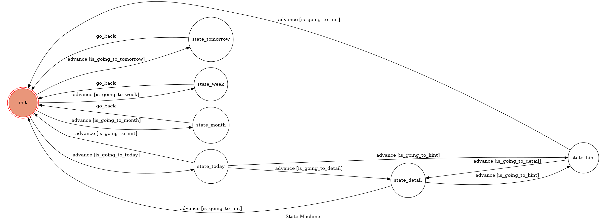

# TOC Project 2019

Template Code for TOC Project 2019

A Facebook messenger bot based on a finite state machine

More details in the [Slides](https://hackmd.io/p/SkpBR-Yam#/) and [FAQ](https://hackmd.io/s/B1Xw7E8kN)

## Setup

### Prerequisite
* Python 3
* Facebook Page and App
* HTTPS Server

#### Install Dependency
```sh
pip3 install requests
```
```sh
pip3 install beautifulsoup4 
```
```sh
pip3 install -r requirements.txt
```

* pygraphviz (For visualizing Finite State Machine)
    * [Setup pygraphviz on Ubuntu](http://www.jianshu.com/p/a3da7ecc5303)


#### Secret Data

`VERIFY_TOKEN` and `ACCESS_TOKEN` **MUST** be set to proper values.
Otherwise, you might not be able to run your code.

#### Run Locally
You can either setup https server or using `ngrok` as a proxy.

**`ngrok` would be used in the following instruction**

```sh
./ngrok http 5000
```

After that, `ngrok` would generate a https URL.

#### Run the sever

```sh
python3 app.py
```

## Finite State Machine


## Usage
總計7個states，初始state為init。

* init
	* Input: '[四位數生日] [-t|-n|-w|-m]'
		* -t: 進入state_today。
		* -n: 進入state_tomorrow。
		* -w: 進入state_week。
		* -m: 進入state_month。
* state_today
	* 回覆該星座今日短評。
	* Input: '[-hint|-detail|-exit]'
		* -hint: 進入state_hint。
		* -datail: 進入state_detail。
		* -exit: 回到init。
* state_hint
	* 回覆該星座今日幸運物。
	* Input: '[-detail|-exit]'
		* -detail: 進入state_detail。
		* -exit: 回到init。
* state_detail
	* 回覆該星座今日完整運勢。
	* Input: '[-hint|-exit]'
		* -hint: 進入state_hint。
		* -exit: 回到init。
* state_tomorrow
	* 回覆該星座明日運勢，之後go_back()回去init。
* state_week
	* 回覆該星座本周運勢，之後go_back()回去init。	
* state_month
	* 回覆該星座本月運勢，之後go_back()回到init。


## Reference
[TOC-Project-2017](https://github.com/Lee-W/TOC-Project-2017) ❤️ [@Lee-W](https://github.com/Lee-W)
[Click108星座](http://astro.click108.com.tw/index.php)
